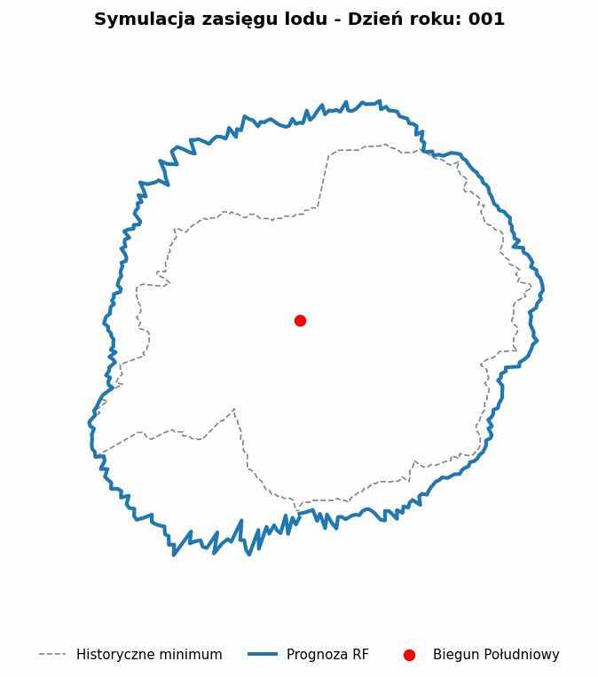
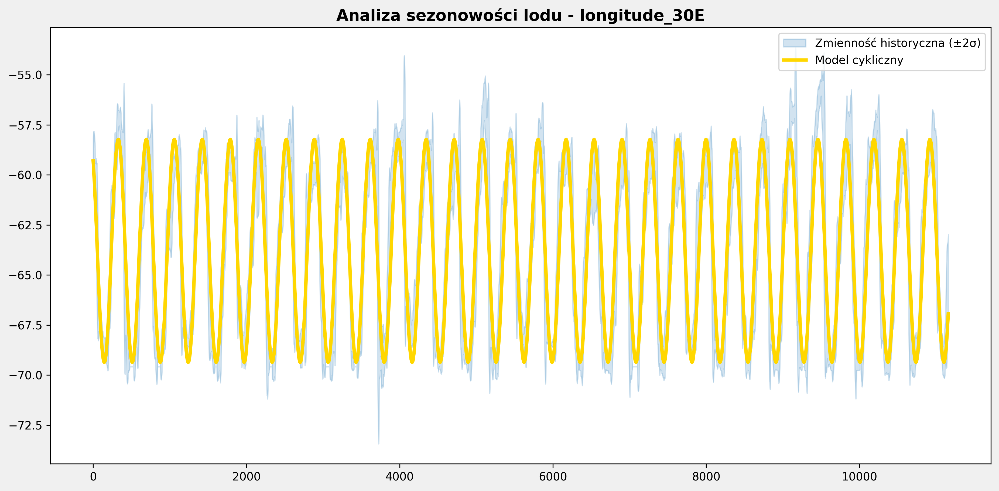

# Analiza i Predykcja Zasięgu Lodu Morskiego Antarktydy 

Projekt zajmuje się modelowaniem granic zlodowacenia Antarktydy na podstawie historycznych danych satelitarnych. Wykorzystano techniki regresji matematycznej oraz uczenia maszynowego (Random Forest) do przewidywania zmian sezonowych.

## 📊 Główne Wyniki Modelu
Zastosowany model **Random Forest** osiągnął wysoką skuteczność w przewidywaniu krawędzi lodu:
* **Współczynnik R²:** 0.8804 (Model wyjaśnia 88% zmienności danych)
* **Błąd MAE:** 1.00° (Średni błąd szerokości geograficznej)
* **Średni błąd liniowy:** ok. **111.01 km**

##  Kluczowe Funkcjonalności
1. **Analiza Sezonowości:** Dopasowanie regresji sinusoidalnej do cykli rocznych.
2. **Modelowanie ML:** Wykorzystanie random forestu do predykcji dynamicznej granicy lodu.
3. **Wizualizacje Geoprzestrzenne:** Transformacja współrzędnych biegunowych na kartezjańskie w celu generowania map.
4. **Automatyczne Generowanie Animacji:** Tworzenie plików GIF obrazujących dynamikę zlodowacenia.

##  Wizualizacje

### 1. Model Predykcyjny (Random Forest)
Poniższa animacja przedstawia predykcję modelu RF dla pełnego cyklu rocznego (365 dni). Niebieska linia to przewidywana krawędź lodu.

### 2. Historia Zmian (Dane Satelitarne)
Animacja prezentująca realne, historyczne zmiany zasięgu lodu morskiego uchwycone w zbiorze danych.

### 3. Analiza Regresji dla wybranego południka
Porównanie surowych danych z wygładzonym trendem (Model cykliczny) oraz obszarem zmienności historycznej ($\pm2\sigma$).

## 🛠️ Technologie
* **Język:** Python 3.x
* **Biblioteki:** `pandas`, `numpy`, `matplotlib`, `scikit-learn`, `imageio`, `tqdm`

## 📂 Dane
Dane źródłowe obejmują zasięg lodu morskiego dla różnych długości geograficznych. Ze względu na rozmiar pliku (>100MB), dane nie są przechowywane bezpośrednio w repozytorium. 

---
*Autor: Kacper Pilecki*
